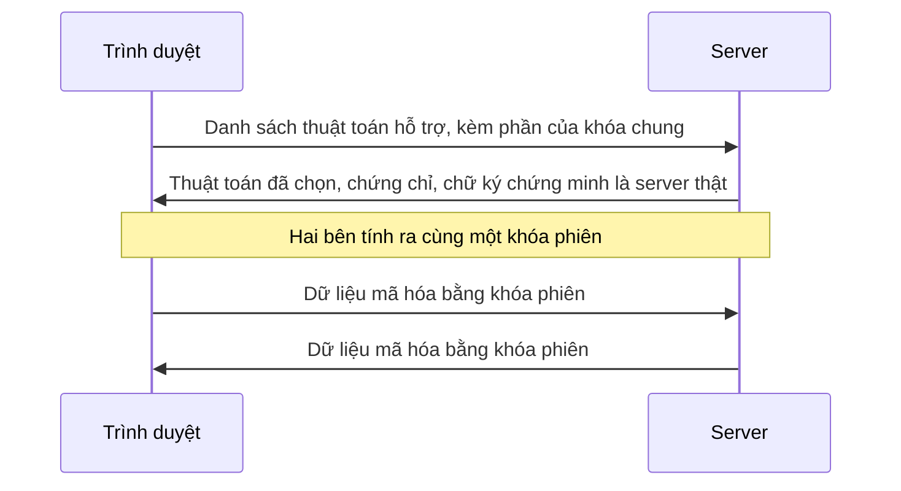

+++
title = "An toàn thông tin cơ bản – Bài 3: Mật mã cơ bản"
date = 2026-09-30T09:03:00+07:00
draft = true
tags = ["bảo mật", "an toàn thông tin", "vibe coding"]
series = ["An toàn thông tin cơ bản"]
series_weight = 3
+++

Giả sử bạn nhờ AI viết hàm "mã hóa mật khẩu trước khi lưu vào cơ sở dữ liệu", và nó trả về đoạn code này:

```python
import base64

mat_khau = "hunter2"
da_luu = base64.b64encode(mat_khau.encode()).decode()
print(da_luu)

# Ai đọc được chuỗi trên cũng lấy lại được mật khẩu, không cần khóa gì cả
print(base64.b64decode(da_luu).decode())
```

```text
aHVudGVyMg==
hunter2
```

Chuỗi `aHVudGVyMg==` nhìn lằng nhằng, nên dễ tưởng đã được mã hóa. Nhưng dòng thứ hai cho thấy chỉ cần một lệnh là lấy lại được mật khẩu gốc, không cần khóa hay bí mật nào. Ai lấy được cơ sở dữ liệu là đọc được hết.

Đoạn code này không sai cú pháp, chạy được, và nhìn qua thì đúng yêu cầu. Cái sai nằm ở chỗ nhầm hai khái niệm khác nhau. Bài này tách chúng ra: encoding, hash, mã hóa đối xứng, chữ ký, và HTTPS ở mức tổng quan, để lần sau bạn đọc code liên quan đến mật mã thì biết nó đang làm việc gì.

<!--more-->

## Bài này dành cho ai

Cho bạn nào đã viết được Python cơ bản và đọc [bài 2](../infosec-basics-2/). Bạn không cần biết toán đằng sau mật mã.

Mình chạy code trên Python 3.14. Các ví dụ về base64 và hash chỉ dùng thư viện chuẩn. Các ví dụ về mã hóa và chữ ký dùng thư viện `cryptography`, mình thử với bản 50.0.2:

```bash
pip install cryptography
```

## Base64 chỉ là cách viết khác

Ở ví dụ trên, base64 là một dạng encoding: đổi dữ liệu sang một bảng ký tự khác cho tiện truyền đi, ví dụ để nhét ảnh vào JSON. Mục đích của nó là tiện lợi, không phải giữ bí mật, nên nó không có khóa và ai cũng đảo ngược được. Hex, URL encoding cũng cùng họ.

Quy tắc dễ nhớ: nếu để đọc lại dữ liệu mà không cần biết bí mật gì, thì đó là encoding. Không dùng nó để bảo vệ thứ gì cả.

## Hash: dấu vân tay của dữ liệu

Hash là thứ khác hẳn. Thử xem SHA-256 làm gì với hai mật khẩu chỉ khác một ký tự:

```python
import hashlib

print(hashlib.sha256("hunter2".encode()).hexdigest())
print(hashlib.sha256("hunter3".encode()).hexdigest())
print(hashlib.sha256("hunter2".encode()).hexdigest())
```

```text
f52fbd32b2b3b86ff88ef6c490628285f482af15ddcb29541f94bcf526a3f6c7
fb8c2e2b85ca81eb4350199faddd983cb26af3064614e737ea9f479621cfa57a
f52fbd32b2b3b86ff88ef6c490628285f482af15ddcb29541f94bcf526a3f6c7
```

Có ba điều đáng để ý. Dữ liệu vào dài bao nhiêu thì kết quả cũng dài 64 ký tự hex. Đổi một ký tự ở đầu vào thì kết quả khác hoàn toàn. Và cùng đầu vào thì luôn ra cùng kết quả, như dòng thứ nhất và thứ ba.

Hash không có chiều ngược lại: từ chuỗi 64 ký tự không có công thức nào tính ra `hunter2`. Vì thế hash dùng để kiểm tra dữ liệu có bị đổi không (so checksum của file tải về), hay làm dấu vân tay cho dữ liệu.

Còn dùng hash để lưu mật khẩu thì sao? Nghe hợp lý vì không đảo ngược được, nhưng có một lỗ hổng: người ta không cần đảo ngược. Họ chỉ cần thử từng mật khẩu phổ biến, hash từng cái, rồi so với cơ sở dữ liệu bị lộ. SHA-256 được thiết kế để chạy rất nhanh, nên thử hàng tỷ mật khẩu là chuyện bình thường. Cách lưu mật khẩu đúng dùng hàm hash cố tình chậm, và đó là nội dung bài 4. Điều cần nhớ lúc này là hash nhanh và hash an toàn để lưu mật khẩu là hai chuyện khác nhau.

Một lưu ý nhỏ: MD5 và SHA-1 đã bị chứng minh là có thể tạo ra hai dữ liệu khác nhau cùng ra một hash. Nếu AI gợi ý hai thuật toán này cho việc cần đến độ tin cậy, hãy đổi sang SHA-256 trở lên.

## Mã hóa đối xứng: cùng một chìa khóa

Khi cần giữ bí mật một dữ liệu mà sau này vẫn đọc lại được, ta dùng mã hóa. Loại đơn giản nhất là đối xứng: một khóa dùng cho cả mã hóa và giải mã. Thử với `Fernet` của thư viện `cryptography`:

```python
from cryptography.fernet import Fernet, InvalidToken

khoa = Fernet.generate_key()
fernet = Fernet(khoa)

token = fernet.encrypt("ghi chú riêng tư".encode())
print(fernet.decrypt(token).decode())

# Dùng sai khóa
try:
    Fernet(Fernet.generate_key()).decrypt(token)
except InvalidToken:
    print("Sai khóa: không giải mã được")

# Sửa một ký tự ở giữa dữ liệu đã mã hóa
bi_sua = bytearray(token)
bi_sua[30] = ord("A") if bi_sua[30] != ord("A") else ord("B")
try:
    fernet.decrypt(bytes(bi_sua))
except InvalidToken:
    print("Dữ liệu bị sửa: bị từ chối")
```

```text
ghi chú riêng tư
Sai khóa: không giải mã được
Dữ liệu bị sửa: bị từ chối
```

Ngoài chuyện giữ bí mật, ví dụ này cho thấy điểm thứ hai: Fernet còn phát hiện dữ liệu bị sửa. Mã hóa tốt không chỉ làm người ngoài không đọc được, mà còn làm họ không sửa lén được mà không bị phát hiện. Đó là lý do nên dùng các công cụ "mã hóa có xác thực" như vậy, thay vì ghép tay từng bước.

Phần khó nhất không nằm ở thuật toán mà ở cái khóa. Khóa nằm ở đâu, ai đọc được, lộ rồi thì xoay thế nào? Ví dụ trên sinh khóa ngay trong chương trình, còn trong thực tế khóa không được nằm trong repository. Bài 6 sẽ nói chuyện này.

## Vì sao không nên tự chế thuật toán

Đến đây có thể có một ý nghĩ: thuật toán trên thư viện khó dùng, mình tự viết một cái đơn giản cho nhanh. Thử xem một thuật toán "tự chế" tưởng như hợp lý, XOR từng byte dữ liệu với một khóa ngắn lặp lại:

```python
def xor(data, khoa):
    return bytes(b ^ khoa[i % len(khoa)] for i, b in enumerate(data))


tin_nhan = "Tai khoan: an, mat khau: mat-khau-cua-an".encode()
da_ma_hoa = xor(tin_nhan, b"khoa")

# Kẻ tấn công đoán tin nhắn bắt đầu bằng "Tai ", rồi suy ngược ra khóa
doan_dau = b"Tai "
khoa_tim_duoc = bytes(c ^ d for c, d in zip(da_ma_hoa, doan_dau))
print(khoa_tim_duoc)
print(xor(da_ma_hoa, khoa_tim_duoc).decode())
```

```text
b'khoa'
Tai khoan: an, mat khau: mat-khau-cua-an
```

Kẻ tấn công không cần biết khóa. Họ chỉ cần đoán đúng vài byte đầu của tin nhắn (nhiều định dạng dữ liệu có phần đầu rất dễ đoán), XOR ngược lại là ra khóa, rồi giải mã toàn bộ. Người viết thuật toán này có thể đã thử mã hóa rồi giải mã thấy chạy đúng, giống như hàm đăng nhập ở bài 1 chạy đúng với trường hợp bình thường.

Đây là lý do mật mã có một quy tắc rất cứng: đừng tự thiết kế, hãy dùng thư viện đã được cộng đồng soi nhiều năm. Khi đọc code do AI viết, nếu thấy các hàm mã hóa tự viết bằng phép XOR hay tự cộng trừ ký tự, nên dừng lại và thay bằng thư viện.

## Cặp khóa: công khai và riêng tư

Mã hóa đối xứng có một vấn đề: hai bên phải có chung một khóa, mà chuyển khóa đó cho nhau qua mạng thế nào cho an toàn? Mật mã bất đối xứng giải quyết chuyện này bằng một cặp khóa. Khóa công khai có thể đưa cho bất kỳ ai. Khóa riêng tư chỉ mình bạn giữ. Điều bạn làm bằng khóa riêng tư thì chỉ khóa công khai tương ứng kiểm chứng được.

Một cách dùng quen thuộc nhất là chữ ký số: chứng minh một nội dung đúng là do chủ của khóa riêng tư tạo ra và chưa bị đổi.

```python
from cryptography.exceptions import InvalidSignature
from cryptography.hazmat.primitives.asymmetric.ed25519 import Ed25519PrivateKey

khoa_rieng = Ed25519PrivateKey.generate()
khoa_cong_khai = khoa_rieng.public_key()

thong_diep = b"chuyen 100000 cho an"
chu_ky = khoa_rieng.sign(thong_diep)

khoa_cong_khai.verify(chu_ky, thong_diep)
print("Chữ ký hợp lệ")

try:
    khoa_cong_khai.verify(chu_ky, b"chuyen 900000 cho an")
except InvalidSignature:
    print("Nội dung đã bị đổi: chữ ký không khớp")
```

```text
Chữ ký hợp lệ
Nội dung đã bị đổi: chữ ký không khớp
```

Đổi một con số trong thông điệp là chữ ký không còn khớp, và chỉ người có khóa riêng tư mới ký được. Cách này dùng ở nhiều chỗ: ký bản phát hành phần mềm, ký commit, ký JWT mà bài 4 sẽ gặp.

Còn việc mã hóa bằng khóa công khai thì sao? Cũng có, nhưng chậm hơn nhiều so với đối xứng. Vì vậy các hệ thống thật thường dùng cặp khóa chỉ để hai bên thống nhất một khóa đối xứng, rồi dùng khóa đó mã hóa dữ liệu. HTTPS làm đúng như thế.

## HTTPS làm gì khi bạn mở một trang

Khi trình duyệt mở một trang HTTPS, nó dùng toàn bộ các mảnh ở trên. Đây là bản rút gọn của TLS 1.3:



Chữ ký và chứng chỉ trả lời câu hỏi "đang nói chuyện với đúng server chưa", bằng cách đối chiếu với các tổ chức cấp chứng chỉ mà trình duyệt tin tưởng. Khóa phiên đối xứng lo phần mã hóa nhanh. Kết quả là người đứng giữa đường truyền không đọc và không sửa được dữ liệu.

Có một thói quen đáng để ý khi đọc code AI viết. Khi gọi một API gặp lỗi chứng chỉ, AI hay gợi ý thêm `verify=False` vào lời gọi của thư viện `requests` cho hết lỗi. Câu đó làm chương trình bỏ qua toàn bộ bước kiểm tra chứng chỉ ở trên, tức là bất kỳ ai ngồi giữa đường truyền đều có thể mạo danh server. Lỗi chứng chỉ là một thông báo có ý nghĩa; nên sửa nguyên nhân (chứng chỉ hết hạn, thiếu chứng chỉ gốc) chứ đừng tắt kiểm tra.

Mật mã sai cách là một nhóm rủi ro riêng trong OWASP Top 10:2025, mục A04 Cryptographic Failures.

## Tóm tắt

- Encoding như base64 chỉ đổi cách viết, không có bí mật nào. Ai cũng đảo ngược được.
- Hash cho ra dấu vân tay cố định của dữ liệu và không đảo ngược được. Hash nhanh không an toàn để lưu mật khẩu; bài 4 nói cách đúng.
- Mã hóa đối xứng dùng một khóa cho cả hai chiều. Nên dùng loại có xác thực như Fernet để vừa giữ bí mật vừa phát hiện dữ liệu bị sửa. Chuyện khó là bảo vệ cái khóa.
- Đừng tự chế thuật toán mật mã. Thuật toán tự chế có thể chạy đúng mà vẫn bị phá chỉ bằng vài phép tính.
- Cặp khóa công khai và riêng tư cho phép ký và kiểm chứng chữ ký. HTTPS dùng chúng để xác nhận server, rồi chuyển sang khóa đối xứng để mã hóa dữ liệu.
- `verify=False` biến HTTPS thành kết nối không kiểm tra ai đang ở đầu bên kia.

## Tài liệu tham khảo

- [Tài liệu Python: module base64](https://docs.python.org/3/library/base64.html)
- [Tài liệu Python: module hashlib](https://docs.python.org/3/library/hashlib.html)
- [Tài liệu cryptography: Fernet](https://cryptography.io/en/latest/fernet/)
- [Tài liệu cryptography: Ed25519 signing](https://cryptography.io/en/latest/hazmat/primitives/asymmetric/ed25519/)
- [RFC 8446: TLS 1.3](https://www.rfc-editor.org/rfc/rfc8446)
- [OWASP Top 10:2025, A04 Cryptographic Failures](https://owasp.org/Top10/2025/) <!-- TODO: kiểm tra link, chưa mở được owasp.org -->
- [OWASP Cryptographic Storage Cheat Sheet](https://cheatsheetseries.owasp.org/cheatsheets/Cryptographic_Storage_Cheat_Sheet.html) <!-- TODO: kiểm tra link -->
